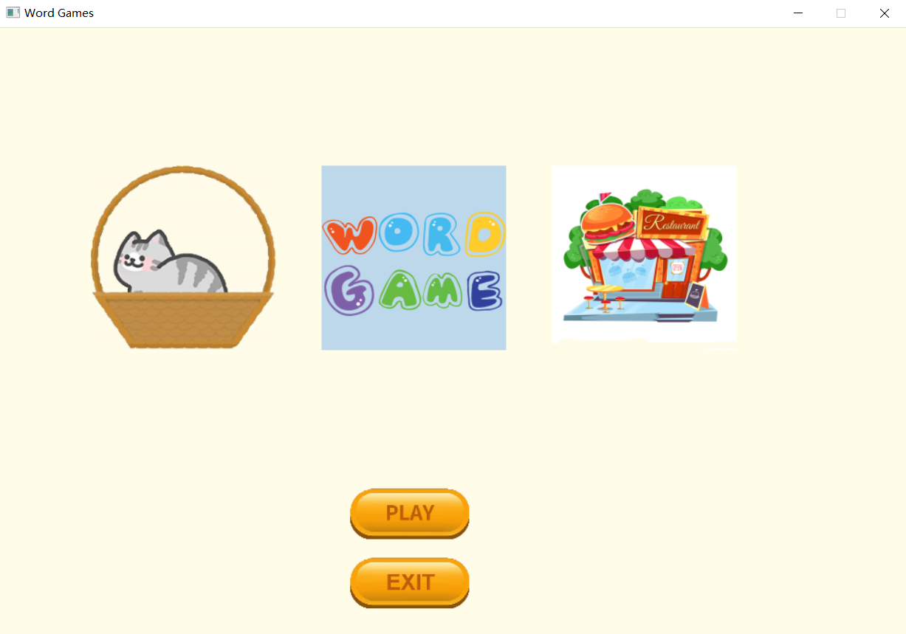

Hello😃, here's who I am

## Hobbies

**Coding** 💻 & **Creating** 🎨

**Laughing** 🤣 & **Learning** 💡

I have TWO cats:

## When I mention coding, I mean

#### 💻 OS

#### 💬 Languages

#### 🪐 Deep Learning && AI

## My projects

#### 🛠 [3D人体风格化动作序列生成](https://github.com/Wenretium/DiFusion-Stylized-Motion-Generation) (TVCG 2025)

We propose DiFusion, a framework for diversely stylized motion generation. It offers flexible control of content through texts and style via multiple modalities, i.e., textual labels or motion sequences. Additionally, our approach can be extended to applications, such as motion style interpolation and motion style transfer.

#### 🛠 中国画风格迁移网络[CIPGAN](https://github.com/Wenretium/CIPGAN)

大二下《深度学习》课程大作业。

#### 🛠 用C++编写带GUI的[背单词小游戏](https://github.com/Wenretium/Word-Games)

大一下学期期末课程大作业，利用 Easyx 制作 GUI。

#### 🛠 个人博客 [Wenretium's Space](https://wenretium.github.io/) 

利用 Hexo 和 github pages，搭建个人博客，可进行同步更新和云备份。

## We may become good friends if you

+ love cats 🐈🐈

+ love F·r·i·e·n·d·s 👨🏻‍🤝‍👨🏻👫👩🏼‍🤝‍👩🏻

+ love LEGO 🧱

+ love games 🎮🎡

+ hate the world 🤷‍♀️ but still want to work for it 🙌

+ ......

If you meet all of these, could I BE more excited?! 😆

## To know more about me

📌Please feel free to contact me by email (wenretium@163.com).

❤🧡💛💚💙💜

 
