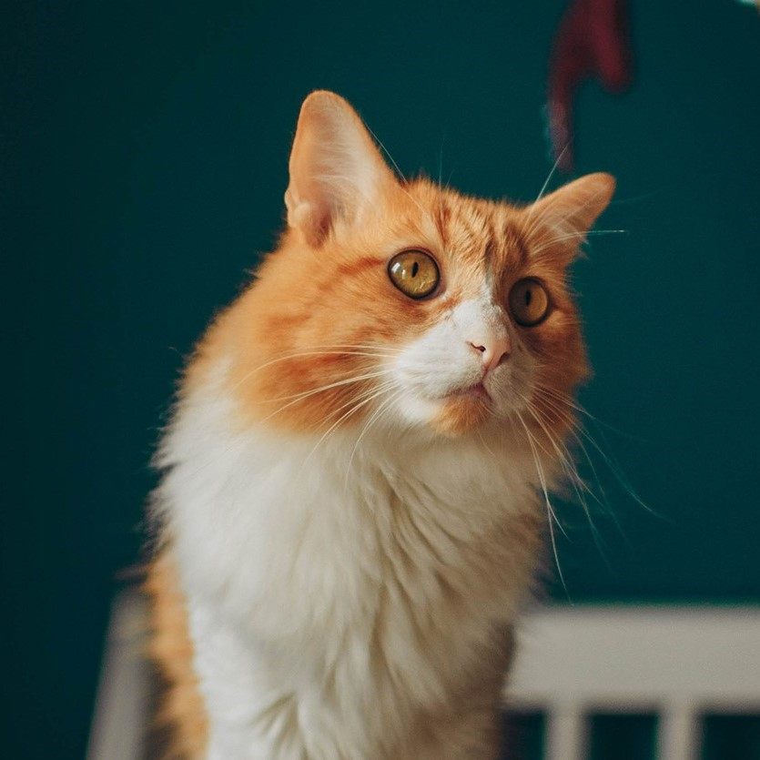
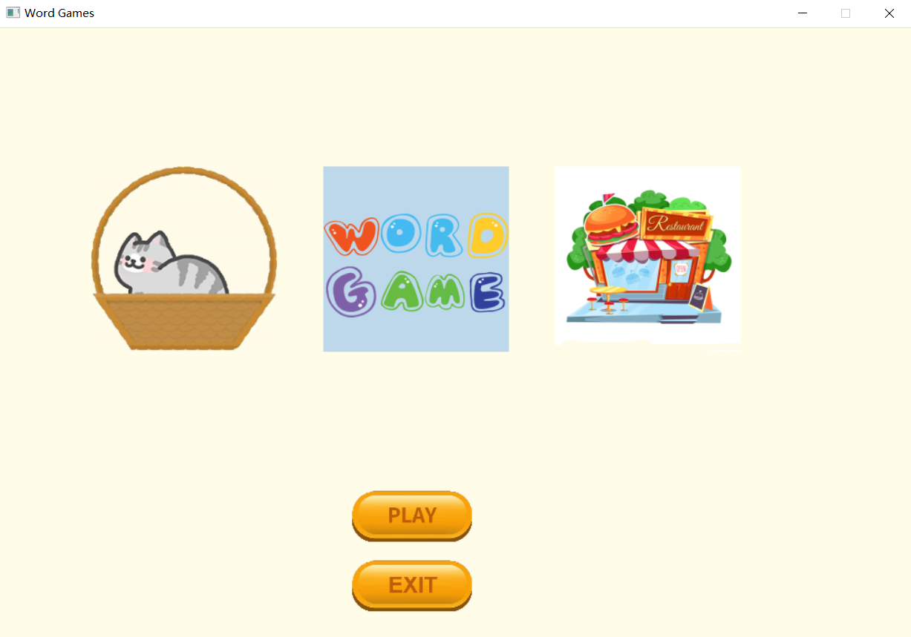
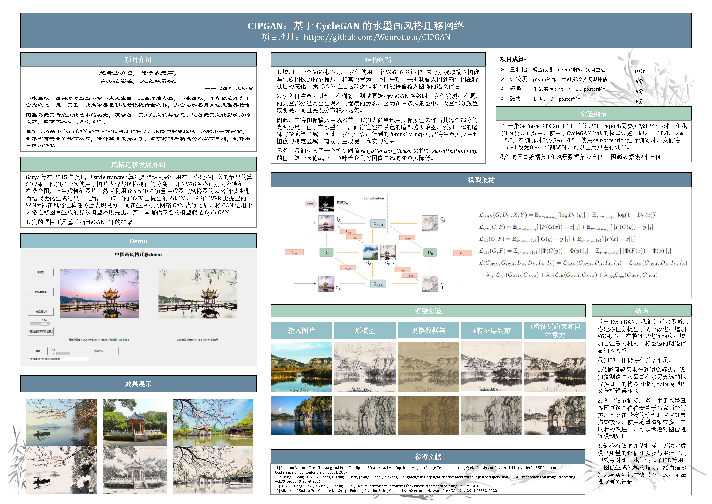

# What is Wenretium?

❤🧡💛💚💙💜

## Hello😃, here's who I am

<table border="0">
  <tr>
    <td width="75%">
      <h1>Wenretium</h1>
      
<b>Undergraduate</b>

      
<b>School of Intelligent Engineering, SYSU</b>

      
<b>Email: wenretium@163.com</b>

      
<b>Address: Shenzhen, China</b>

      
<b>Hometown: Guangdong, China</b>

    </td>
    <td width="25%">
           
    </td>
  </tr>
</table>

## Hobbies

**Coding** 💻 & **Creating** 🎨

**Laughing** 🤣 & **Learning** 💡

## Currently, I am
+ enjoying (or struggling in sometimes) my current study 📚
+ preparing for my further study 📜
+ looking for funny things everyday 😋

## When I mention coding, I mean

#### 💻 OS

#### 💬 Languages

#### 🍰 Projects

**Front-end:**  (just interested in)

**Back-end:** (just interested in)

#### 🪐 Deep Learning && AI

#### 📝 Notes

## My projects

#### 🛠 个人博客 [Wenretium's Space](https://wenretium.github.io/) 

利用 Hexo 和 github pages，搭建个人博客，可进行同步更新和云备份。

#### 🛠 用C++编写带GUI的[背单词小游戏](https://github.com/Wenretium/Word-Games)

大一下学期期末课程大作业，利用 Easyx 制作 GUI。

#### 🛠 中国画风格迁移网络[CIPGAN](https://github.com/Wenretium/CIPGAN)

大二下《深度学习》课程大作业。

#### 🛠 道路图像处理网站LightSRoad

大创成果。

## We may become good friends if you

+ love cats 🐈🐈

+ love F·r·i·e·n·d·s 👨🏻‍🤝‍👨🏻👫👩🏼‍🤝‍👩🏻

+ love LEGO 🧱

+ love games 🎮🎡

+ hate the world 🤷‍♀️ but still want to work for it 🙌

+ ......

If you meet all of these, HAHA could I BE more excited?! 😆

## To know more about me

📌 My Blog: [Wenretium's Space](https://wenretium.github.io/) 

📌 [CSDN Blog](https://blog.csdn.net/weixin_45725902?spm=1000.2115.3001.5343)

📌Please feel free to contact me by email.

❤🧡💛💚💙💜

 
